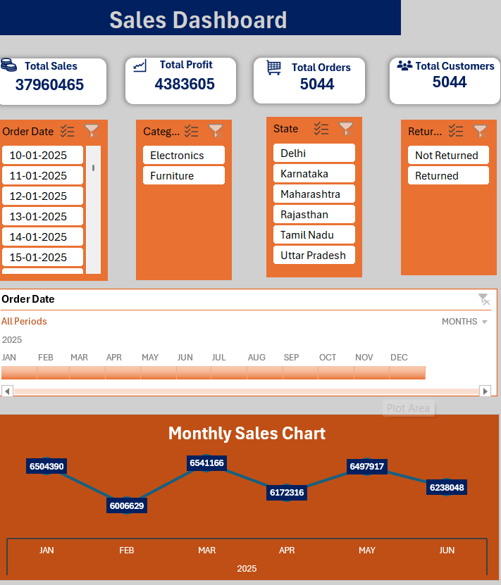
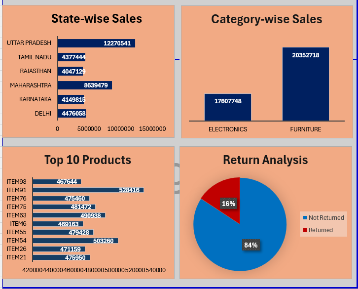

#  Retail Sales Analysis Dashboard (Excel)

##  Project Overview

This project is an **Excel-based Retail Sales Analysis Dashboard** created to analyze retail business performance using multiple datasets.

The project involved data cleaning, data transformation, merging multiple tables, creating Pivot Tables, Pivot Charts, and designing an interactive dashboard to generate meaningful business insights.

---

##  Dashboard Preview

###  Dashboard Top View

###  Dashboard Bottom View

---

##  Dataset Structure

This project contains four different Excel sheets:

### 1. Sales_Data Sheet
- Contains sales transaction records
- Includes order and sales-related information
- Used as the primary transaction table for analysis

### 2. Returns Sheet
- Contains returned order details
- Helps analyze returned products and return patterns

### 3. Product Sheet
- Contains product master information
- Includes product details and category information

### 4. Customer Sheet
- Contains customer-related information
- Helps analyze customer behavior and purchasing patterns

---

##  Data Cleaning & Transformation

Data preparation steps performed:

- Removed duplicate records
- Handled missing values
- Cleaned inconsistent data
- Standardized data formats
- Corrected data types
- Merged multiple sheets into a final analysis dataset

---

##  Tools & Techniques Used

- Microsoft Excel
- Power Query
- Data Cleaning
- Data Transformation
- Pivot Tables
- Pivot Charts
- Excel Formulas
- Dashboard Designing
- Data Visualization

---

##  Dashboard Features

### KPI Metrics:
- Total Sales
- Total Profit
- Total Orders
- Total Quantity Sold
- Average Sales
- Return Analysis

### Charts & Analysis:
- Sales Performance Analysis
- Category-wise Sales Analysis
- Product Performance Analysis
- Customer Analysis
- Return Analysis
- Sales Trends

---

##  Business Insights

- Analyzed overall sales performance.
- Identified high-performing products and categories.
- Studied customer purchasing patterns.
- Evaluated product return behavior.
- Created an interactive dashboard for better business decision-making.

---

##  Project Files

 Excel Dashboard File:
`Retail_Sales_Analysis_Dashboard.xlsx`

 Dashboard Images:
- `dashboard-top.png`
- `dashboard-bottom.png`

---

##  Author

**Shrishti Singh**

Aspiring Data Analyst

Skills:
Excel | Power Query | Power BI | Data Analysis | Dashboard Development
